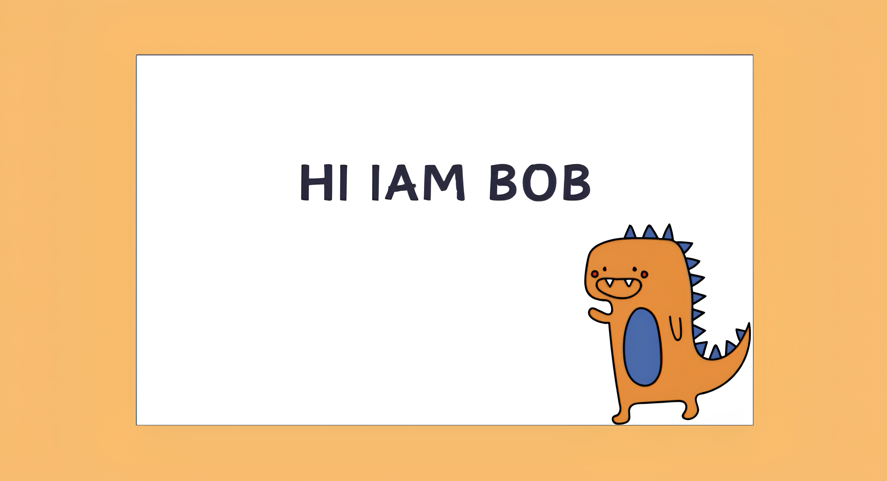
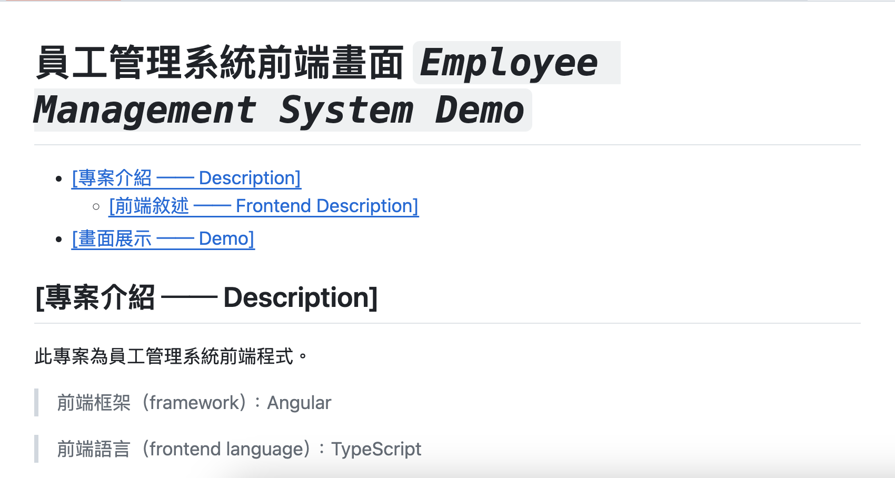
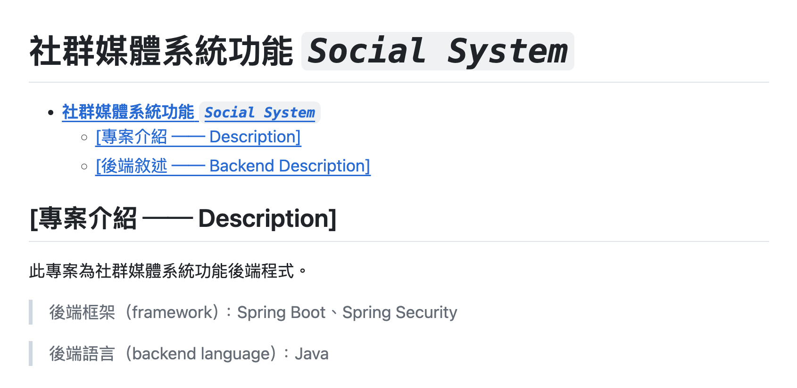
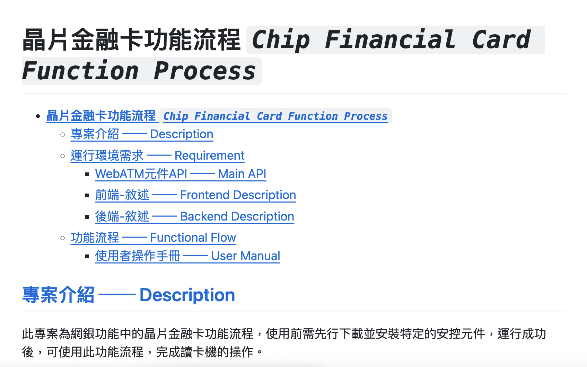

![][1]

🐷 About Me

>

-   

🐽 Who I am

    >

    -   🧑🏻‍💻 A software engineer

    

-   

🗿 About repository

    >

    [][2]
    [][3]
    [][4]

    

[1]: https://komarev.com/ghpvc/?username=ZhongYah&color=orange&style=for-the-badge
[2]: https://github.com/ZhongYah/employee-management-system-frontend
[3]: https://github.com/ZhongYah/social-system-backend
[4]: https://github.com/ZhongYah/chip_financial_card_file
